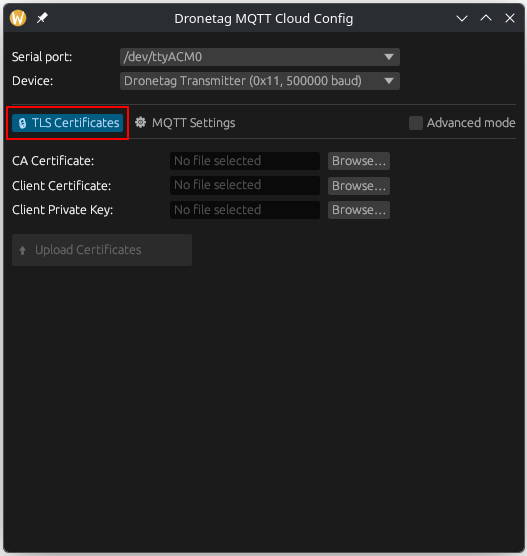
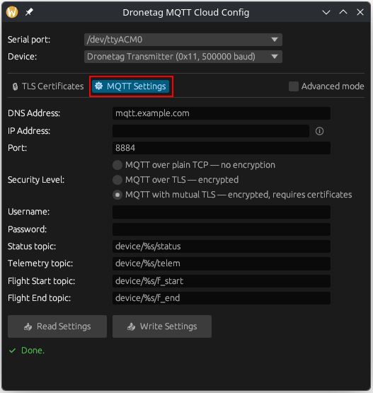
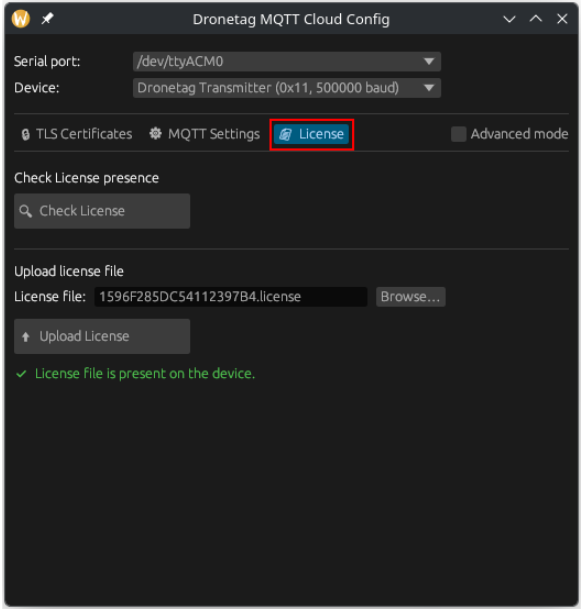

# Dronetag MQTT Cloud Config

Desktop configuration tool for setting up MQTT cloud connectivity on Dronetag devices over USB serial.

## Quick start

If you just want to use the app:

1. Open the repository's `Releases` page.
2. In the latest release, open `Assets`.
3. Download the archive for your platform.
4. Extract.
5. Run the GUI application:
   - Windows: `dt-cert-uploader-gui.exe`
   - Linux: `dt-cert-uploader-gui`
   - macOS: `dt-cert-uploader-gui.app`

The release archives also include the CLI executable if you prefer scripting or terminal-based use.

This Rust project contains a cross-platform GUI application for:

- Uploading TLS certificate files to supported Dronetag devices
- Checking whether a Dronetag license is already present on the device
- Uploading a Dronetag license file to the device
- Reading current MQTT-related settings from the device
- Writing MQTT broker configuration back to the device
- Switching between plain MQTT, TLS, and mutual TLS modes

It is intended for configuring Dronetag devices when integrating them with a custom MQTT backend.

## What the app configures

The application works with the MQTT cloud transport settings exposed by Dronetag firmware, including:

- Broker address
- Broker port
- Username and password
- MQTT topics used by the device
- TLS security mode
- TLS security tag for certificate association

For mutual TLS, the app uploads the certificate bundle expected by the device modem storage:

- `CA Certificate` -> `/storage/ca_<sec_tag>.crt`
- `Client Certificate` -> `/storage/client_<sec_tag>.crt`
- `Client Private Key` -> `/storage/client_<sec_tag>.key`

## Supported devices

- Dronetag Transmitter
  - Includes Dronetag Mini 4G / Mini
  - MCUmgr mux address `0x11`
  - Settings mux address `0x13`
  - Baud rate `500000`
- Dronetag RIDER
  - Receiver device
  - MCUmgr mux address `0x23`
  - Settings mux address `0x25`
  - Baud rate `115200`

## Main workflows

The GUI is split into three tabs:

### 1. TLS Certificates



Uploads the three certificate files required for mutual TLS:

- CA certificate
- Client certificate
- Client private key

The `TLS Certificates` tab is the place to prepare the device for mutual TLS authentication. Select the serial port and device type at the top, choose the three PEM-encoded certificate files, and upload them to the modem storage. In the default mode, the app uses security tag `1`; in Advanced mode, you can select a different security tag so multiple TLS contexts can coexist on the same device.

> [!NOTE]
> PEM-encoded X.509 files are expected. Typical file extensions are `.crt`, `.cer`, `.pem`, and `.key`.
> Each certificate file must be non-empty and at most 5 KB.
> In normal mode, certificate uploads use security tag `1`; in Advanced mode, security tags `1-5` can be selected.

### 2. MQTT Settings



Reads and writes the MQTT configuration stored on the device.

The `MQTT Settings` tab is used to point the device at your broker and define how it publishes data. This includes the broker DNS name or IP address, port, optional username and password, security level, and the MQTT topics used by the device. A practical workflow is to first click `Read Settings`, adjust only the fields you need, then click `Write Settings`, and finally read the settings again to confirm the device accepted them.

> [!NOTE]
> A good workflow is to use `Read Settings` before making changes, then `Write Settings`, and finally `Read Settings` again to verify the values stored on the device.

### 3. License



Checks for the device license and uploads a new one when needed.

The `License` tab checks for a license file in device storage and uploads one when needed. Use `Check License` to test whether `/storage/license.json` is present on the device, then select your local license file and click `Upload License` if the device reports that the file is missing.

> [!NOTE]
> `Check License` only confirms file presence. It does not validate the license content or whether the license is usable.
> License validation is performed by the device itself.
> License files are uploaded to `/storage/license.json`.
> The GUI accepts files selected via the file picker with `.json` and `.license` filters.
> License files must be non-empty and at most 4 KB.
> A practical workflow is to run `Check License` before uploading, upload the file if needed, and then run `Check License` again to confirm the file is now present on the device.

The app manages:

- `dt_cloud.cloud_client`
- `dt_trans_mqtt.*`

When writing settings, the app ensures:

- `dt_cloud.cloud_client` is set to `DT_TRANS_MQTT_CLIENT`
- `nested: true` is present
- `save: true` is present

This activates the MQTT transport client and persists the settings on the device.

## Security modes

The app supports these MQTT security modes:

- Plain TCP
  - `sec_tag = -1`
  - For unencrypted MQTT, commonly on port `1883`
- TLS
  - `sec_tag = 0`
  - For encrypted MQTT without client certificates, commonly on port `8883`
- Mutual TLS
  - `sec_tag > 0`
  - For encrypted MQTT with client certificate authentication, commonly on port `8884`

> [!IMPORTANT]
> The selected security tag in MQTT settings must match the security tag used for uploaded certificate files.
> If Advanced mode is disabled, the GUI defaults to security tag `1` for mutual TLS.

## Why this tool exists

Dronetag Toolbox can configure MQTT-related settings, but certificate upload is not currently supported there. That means full mutual TLS setup requires this desktop app.

This tool fills that gap by providing:

- Device-side MQTT settings configuration
- TLS certificate upload over serial
- Device license presence check and license upload

## Workspace layout

This repository is a Rust workspace with three crates:

- `core`
  - Shared serial, SLIP, MCUmgr, certificate upload, and settings logic
- `gui`
  - Native desktop GUI built with `egui` / `eframe`
- `cli`
  - Command-line interface for scripting and debugging

## Download prebuilt binaries

GitHub Releases include prebuilt binaries for the main desktop platforms, so most users do not need to build the project from source.

To get started quickly, open the repository's `Releases` page, expand the `Assets` section of the latest release, and download the archive for your platform.

Release artifacts are produced for:

- Windows x86_64
- macOS Apple Silicon
- macOS Intel
- Linux x86_64

Each release archive includes:

- the GUI application
- the CLI executable

Archive formats:

- Linux and macOS: `.tar.gz`
- Windows: `.zip`

On macOS, the GUI is packaged as a `.app` bundle inside the release archive.

## Building from source

If you prefer, you can also build the project locally with Cargo.

Requirements:

- Rust toolchain with Cargo
- USB serial access to the target device

Build the GUI:

```bash
cargo build -p dt-cert-uploader-gui
```

Run the GUI:

```bash
cargo run -p dt-cert-uploader-gui
```

Build the CLI:

```bash
cargo build -p dt-cert-uploader-cli
```

Run the CLI help:

```bash
cargo run -p dt-cert-uploader-cli -- --help
```

## CLI usage

The CLI supports both certificate upload and MQTT settings read/write.

Basic help:

```bash
dt-cert-uploader-cli --help
```

Upload certificate bundle:

```bash
dt-cert-uploader-cli \
  --port /dev/ttyACM0 \
  --device transmitter \
  --sec-tag 1 \
  --ca ca.crt \
  --client-cert client.crt \
  --client-key client.key
```

Read current MQTT settings:

```bash
dt-cert-uploader-cli \
  --port /dev/ttyACM0 \
  --device transmitter \
  --read-settings
```

Write MQTT settings from inline JSON:

```bash
dt-cert-uploader-cli \
  --port /dev/ttyACM0 \
  --device transmitter \
  --write-settings '{"dt_cloud":{"cloud_client":"DT_TRANS_MQTT_CLIENT"},"dt_trans_mqtt":{"dns_addr":"broker.example.com","port":8883,"sec_tag":0,"user_name":"","password":"","telemetry_topic":"device/%s/telemetry","status_topic":"device/%s/status","f_start_topic":"device/%s/flight/start","f_end_topic":"device/%s/flight/end"}}'
```

## Typical setup flow

> [!WARNING]
> Access to the MQTT client on Dronetag devices requires a valid Dronetag license.
> Device-side MQTT configuration alone is not sufficient if the license is missing.

> [!NOTE]
> Manual license upload is optional.
> Normally, the device can download its license automatically from the MQTT broker if it does not already have one stored.
> On boot, the device will try to acquire a license when needed by subscribing to `v1/device/<device_serial_number>/license`.
> The MQTT server or broker side is responsible for publishing the license file there, typically as a retained MQTT message so the device receives it immediately after subscribing.

For a new MQTT integration, the recommended order is:

1. Connect the device over USB and select the correct serial port and device type.
2. Open `MQTT Settings` and use `Read Settings` to load the current configuration.
3. Configure broker address, port, credentials, and topics.
4. Choose the required security mode.
5. If using mutual TLS, upload the CA certificate, client certificate, and private key in `TLS Certificates`.
6. Make sure the selected `sec_tag` in MQTT settings matches the uploaded certificate set.
7. Write settings to the device.
8. Read settings again to confirm the values were applied.
9. If you need to provision the license manually instead of delivering it from the MQTT broker, open `License`, use `Check License` to see whether `/storage/license.json` is already present, upload the file if needed, and run `Check License` again to confirm the file now exists on the device.

## Implementation notes

- Serial communication uses muxed SLIP framing
- Certificate upload is performed over MCUmgr file transfer
- MQTT settings are exchanged as JSON over the device settings mux channel
- The GUI auto-refreshes available serial ports
- On Windows, DTR and RTS are asserted for Dronetag Transmitter communication

## Limitations and assumptions

- A valid Dronetag license is required for the device to access MQTT cloud connectivity
- This tool expects firmware with MQTT cloud connectivity support
- The device must expose the required `dt_cloud` and `dt_trans_mqtt` settings groups
- Certificate files must fit within the device-side size constraints enforced by this app
- The application configures the device only; broker reachability, certificates, topic handling, and license serving must be handled on the server side
